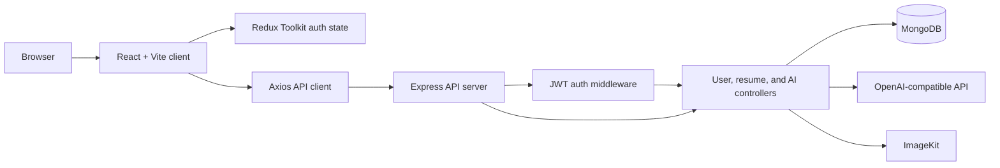

# Resume Builder

A full-stack MERN application for creating, editing, customizing, and sharing professional resumes. Resume Builder combines a guided React editor with reusable templates, JWT authentication, MongoDB persistence, AI-assisted writing, profile image uploads, and public read-only resume pages.

## Features

- Register and sign in with JWT-based authentication.
- Create and manage multiple resumes from a personal dashboard.
- Edit personal information, professional summary, experience, education, projects, and skills.
- Choose from Classic, Modern, Minimal, and Minimal Image templates.
- Customize the resume accent color.
- Enhance professional summaries and job descriptions with OpenAI.
- Upload an existing resume as text for AI-assisted data extraction.
- Upload a profile image and store it with ImageKit.
- Toggle a resume between private and public visibility.
- Share public resumes through `/view/:resumeId`.
- Print the rendered resume from the browser using the builder's Download action.
- Responsive React interface with toast notifications and icon-based controls.

## Architecture



The client and server are separate applications:

- `client/` contains the Vite-powered React UI, route-level pages, Redux state, forms, templates, and API client.
- `server/` contains the Express server, JWT middleware, controllers, Mongoose models, file upload handling, and integrations with OpenAI and ImageKit.
- MongoDB stores users and resume documents. Images are uploaded to ImageKit rather than stored in MongoDB.

## Tech Stack

### Frontend

- React 19
- Vite 7
- React Router
- Redux Toolkit and React Redux
- Tailwind CSS 4
- Axios
- React Hot Toast
- Lucide React
- `react-pdftotext` for extracting text from uploaded PDF resumes

### Backend

- Node.js with ES modules
- Express 5
- MongoDB with Mongoose
- JSON Web Tokens
- bcrypt
- Multer
- ImageKit Node SDK
- OpenAI SDK
- dotenv and CORS

## Project Structure

```text
Resume-Builder/
|-- client/
|   |-- public/                     Static public assets
|   |-- src/
|   |   |-- app/                    Redux store and authentication slice
|   |   |-- assets/                 Shared data, images, and resume templates
|   |   |-- components/             Forms, preview, navigation, and home sections
|   |   |-- configs/api.js           Axios instance
|   |   |-- pages/                  Home, login, dashboard, builder, and preview
|   |   |-- App.jsx                 Client route definitions
|   |   `-- main.jsx                React entry point
|   |-- package.json
|   `-- vite.config.js
|-- server/
|   |-- configs/                    Database, AI, ImageKit, and upload setup
|   |-- controllers/                User, resume, and AI request handlers
|   |-- middlewares/                JWT protection middleware
|   |-- models/                     User and resume schemas
|   |-- routes/                     User, resume, and AI route definitions
|   |-- server.js                   Express entry point
|   `-- package.json
|-- .gitignore
`-- README.md
```

## Requirements

- Node.js 18 or newer
- npm
- MongoDB locally or through MongoDB Atlas
- An OpenAI API key for AI features
- An ImageKit account and private key for profile images

## Configuration

### Server environment

Create `server/.env`:

```env
PORT=3000
MONGODB_URI=mongodb://127.0.0.1:27017
JWT_SECRET=replace_with_a_long_random_secret
OPENAI_API_KEY=your_openai_api_key
OPENAIBASE_URL=https://api.openai.com/v1
OPENAI_MODEL=your_model_name
IMAGEKIT_PRIVATE_KEY=your_imagekit_private_key
```

`MONGODB_URI` is used as the base connection string. The server appends the `resume-builder` database name when it connects.

### Client environment

Create `client/.env`:

```env
VITE_BASE_URL=http://localhost:3000
```

Do not commit either `.env` file. API keys and JWT secrets must remain outside source control.

## Getting Started

Clone the repository and install dependencies for both applications:

```bash
git clone https://github.com/Mkn1261/Resume-Builder.git
cd Resume-Builder

cd server
npm install

cd ../client
npm install
```

Start the backend in one terminal:

```bash
cd server
npm run server
```

Start the frontend in another terminal:

```bash
cd client
npm run dev
```

Open the Vite URL shown in the terminal, normally:

```text
http://localhost:5173
```

The API runs on `http://localhost:3000` unless `PORT` is changed.

For a production-style client build:

```bash
cd client
npm run build
npm run preview
```

## Application Routes

| Route | Purpose | Access |
| --- | --- | --- |
| `/` | Landing page with product overview and calls to action | Public |
| `/app` | Dashboard for saved resumes | Authenticated |
| `/app/builder/:resumeId` | Guided resume editor and live preview | Authenticated |
| `/view/:resumeId` | Read-only public resume preview | Public when the resume is public |

## API Reference

The client sends the JWT in the `Authorization` header. The current middleware expects the token value directly:

```http
Authorization: <jwt>
```

### Users: `/api/users`

| Method | Endpoint | Description | Auth |
| --- | --- | --- | --- |
| `POST` | `/register` | Create an account and return a token | No |
| `POST` | `/login` | Authenticate a user and return a token | No |
| `GET` | `/data` | Get the authenticated user's profile | Yes |
| `GET` | `/resumes` | List resumes owned by the authenticated user | Yes |

Registration and login expect JSON containing `name`, `email`, and `password` for registration, or `email` and `password` for login.

### Resumes: `/api/resumes`

| Method | Endpoint | Description | Auth |
| --- | --- | --- | --- |
| `POST` | `/create` | Create a resume from a title | Yes |
| `GET` | `/get/:resumeId` | Get one owned resume | Yes |
| `PUT` | `/update` | Save resume data and optionally upload an image | Yes |
| `DELETE` | `/delete/:resumeId` | Delete an owned resume | Yes |
| `GET` | `/public/:resumeId` | Read a public resume | No |

The update endpoint accepts multipart form data. The main fields used by the client are `resumeId`, a JSON-encoded `resumeData`, an optional `image`, and the optional `removeBackground` flag.

### AI: `/api/ai`

| Method | Endpoint | Description | Auth |
| --- | --- | --- | --- |
| `POST` | `/enhance-pro-sum` | Improve a professional summary | Yes |
| `POST` | `/enhance-job-description` | Improve a job description | Yes |
| `POST` | `/upload-resume` | Extract structured resume data from supplied text | Yes |

The enhancement endpoints expect `{ "userContent": "..." }`. Resume extraction expects `resumeText` and can also receive a `title`.

## Resume Data Model

A resume stores the following main fields:

- `title`, `public`, `template`, and `accent_color`
- `professional_summary`
- `skills`
- `personal_info`: name, profession, contact details, links, and image URL
- `experience`: company, position, dates, description, and current-role status
- `project`: name, type, and description
- `education`: institution, degree, field, graduation date, and GPA
- `userId`: the owning user reference

## Available Scripts

### Client

```bash
npm run dev       # Start the Vite development server
npm run build     # Build the production client bundle
npm run lint      # Run ESLint
npm run preview   # Preview the production build
```

### Server

```bash
npm start         # Start the server with Node.js
npm run server    # Start the server with nodemon
```

## Security Notes

- Keep `server/.env` and `client/.env` local and out of Git.
- Use a strong, unique `JWT_SECRET` in deployed environments.
- Restrict CORS and configure HTTPS before deploying publicly.
- Do not expose the ImageKit private key or OpenAI key to the browser.
- Validate uploaded files and request sizes before exposing the upload endpoint publicly.

## Current Limitations

- Resume download currently uses the browser print dialog; there is no server-side PDF or Word export.
- The application does not include automated test suites yet.
- A running MongoDB instance and external AI/ImageKit credentials are required for the full feature set.

## License

No license has been specified for this project yet.
